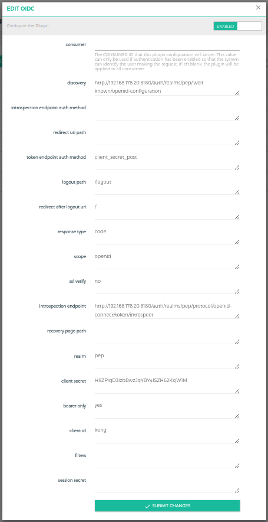

# API protection with Kong API Gateway and Keycloak integration 

This repo shows how to protect your APIs using the Kong API Gateway working as PEP proxy with a Keycloak integration for authentication and authorization of incoming requests.

## 1. Install 

The source code of all plugins must be in the respective folder, meaning:
1. luaplugins : This folder contains plugins written in lua language. Currently, the plugin "multi-tenancy" which validates for the _fiware-service header_ in the request against the one in the presented auth token, and the plugin "rbac" which supports _role based access control_ for upstream services are included. The "query-checker" plugin is included - yet, it's still in development. Plugins written in lua language provide the advantage of configuration via a GUI using Konga. Konga is a web GUI for the kong proxy. 
2. plugins : You can create your own plugins written in JavaScript here.

To use kong, we need to build an image using docker. Simply 1) clone this repo and navigate towards the kong folder and 2) use the command:
```
docker-compose build kong
```

## 2. Setup 

If kong is run for the first time, it is necessary to perform Database migration using the below commands:
```
docker-compose up -d kong-db
docker-compose run --rm kong kong migrations bootstrap
docker-compose run --rm kong kong migrations up (for upgrading from previous version)
```
Once the data migrations is performed , you can start the remaining services.
```
docker-compose up -d kong 
docker-compose up -d konga
```
Make sure all the services are up and running.

*Note* : If it is not the first time starting kong and kong-db services , you can clone and run `docker-compose up -d ` directly. 

## 3. Kong/Konga Configurations
All the configurations below are done using Konga GUI. After the inital setup, create an admin account in Konga GUI which can be accessed at `http://<machine-ip>:1337` 

### 3.1 Creation of a Service
Create a new service by clicking the Services button in the left navigation bar. Fill in the necessary details in the GUI. As a example, we create a service for the Orion Context Broker. 


*Note* : If you are deploying on a local machine it is important to use the ip address of the local machine instead of localhost due to issues with kong.

### 3.2 Creation of Routes
Creating new routes for a given service is fairly simple. Just like creating a new service, a route can be added/created for a service. So click on the Routes tab in the services page (after clicking on a service), in this example orion service. Fill in details for Paths, e.g. */v2/entities* and headers in case you need to check any particular headers. 
*Note* : fiware-service header will be checked using the multi-tenancy plugin, so there is no need to enter it here.

### 3.3 Keycloak configs for Kong

1. Click on the 'Plugins' tab in the main navigation bar on the left side.
2. Click on 'ADD GLOBAL PLUGINS'.
3. Click on 'Other' and then select 'Add Plugin' option on the oidc plugin
Configure the oidc plugins as shown in the image below with the configurations as per your client. 



For client creation in Keycloak, please refer to [this guide](kongkeycloak.pdf).

### 3.4 Configure custom plugins

To add any plugin, we follow the same procedure as done before with the OIDC plugin. Here, we give an example on how to add the multi-tenany plugin for the orion service. 
- Go to the orion service created in Step 3.1, click on the plugins tab on the left side under the selected service.
- Click on ADD PLUGIN option on the right side, then click on others and select multi-tenancy plugin in the option. There is no need to fill any values as the plugin matches fiware-service header to the same in the Auth Token.

#### 3.4.1 Configuring Milti-Tenancy Plugin

You can add the plugin and global, service or at route level. Select the plugin in the 'Add Plugin' section. 

`tenant name` (required) field defines the custom header name. It can be renamed as per your custom requirement. This field will be checked against the token presented in the request.


#### 3.4.2 Configuring RBAC Plugin

Similar to the multi-tenancy plugin, this plugin can be used at global, service or routes level. 

- `tenant name`(required)(String) field defines the custom header name. It can be renamed as per your custom requirement. 

- `use custom roles`(optional)(Bool) is a boolean field that decides whether to include custom roles for rbac. 

- `read role` (depends on 'use custom roles')(String) Pre-defined role needed for GET-requests.
- `write role` (depends on 'use custom roles')(String) Pre-defined role needed for PATCH, PUT, and POST requests.
- `admin role` (depends on 'use custom roles')(String) Pre-defined role needed for DELETE requests.
- `include client role` (optional)(Bool) field indicated whether to use client roles or user roles configured in Keycloak.
- `client name` (depends on include client role)(String) field is used to specify the name of the client. 


## Testing

After following the above steps, you can test the funcionalities of kong and its plugins using any rest client, e.g. postman or insomnia.

- Get a token from keycloak after creating a user. 
- Use the Authorization header to fill the above recieved token in the format 'Bearer <*token*>'
- Add fiware-service header in the request and make sure it is put in the user token.
- Send the request and verify.


## Docs

- kong-docs-url: https://docs.konghq.com/
- kong-js-plugins: https://github.com/Kong/docker-kong-js-pdk
- oidc-plugin: https://github.com/nokia/kong-oidc
